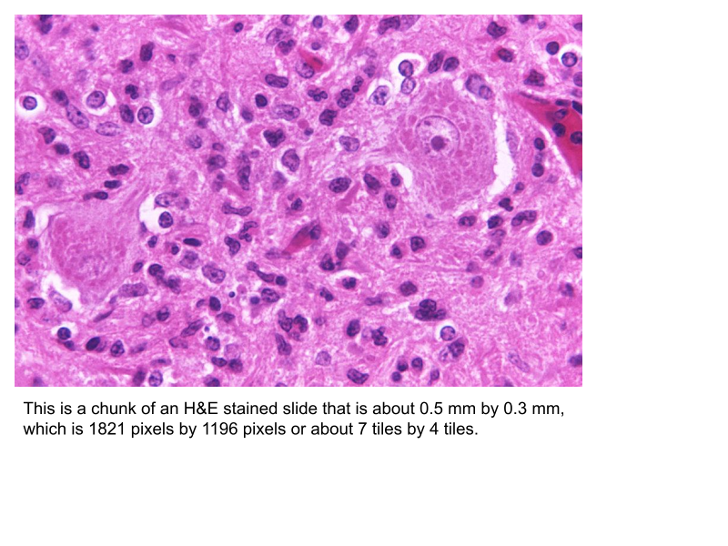

# histomics_stream

[](https://github.com/InsightSoftwareConsortium/ITK/blob/master/LICENSE) [](https://pypi.python.org/pypi/histomics_stream) [](https://github.com/DigitalSlideArchive/histomics_stream) [](https://colab.research.google.com/github/DigitalSlideArchive/histomics_stream/blob/master/example/tensorflow_stream.ipynb)

## Overview

The goal of this project is to create a whole-slide image file reader for machine learning.  This reader allows users to extract pixel data from whole-slide image formats, and supports reading paradigms that are commonly used during machine learning training and inference.  The package currently supports TensorFlow 2.

## Installation for Python

`histomics_stream` can be easily installed with Python wheels.  If you do not want the installation to be to your current Python environment, you should first create and activate a [Python virtual environment (venv)](https://docs.python.org/3/tutorial/venv.html) to work in.  Then, run the following from the command lines:

```shell-script
sudo apt update
sudo apt install -y python3-openslide openslide-tools
pip install histomics_stream 'large_image[openslide,ometiff,openjpeg,bioformats]' \
  scikit_image --find-links https://girder.github.io/large_image_wheels
```

After launching `python3`, import the `histomics_stream` package with:

```python
import histomics_stream as hs
```

This has been tested with `tensorflow:2.6.2-gpu` and `tensorflow:2.8.0-gpu`.

## History

Through version 1.0.6, this project was known as `tensorflow_reader`.

## Introduction



Histopathology is the study of biopsied tissues under the microscope for the purpose of diagnosing disease.  Glass slides of tissue specimens are prepared by staining thin tissue slices with chemicals to highlight cellular structures for examination.  Traditionally pathologists have examined glass slides to look for telltale signs of disease, but recently whole-slide images (WSIs) that digitize the entire slide at high magnification are being used in diagnosis.  A single research study may involve thousands of WSIs, each containing several billion pixels that need to be analyzed by medical personnel.  Computer vision algorithms based on machine learning are also increasingly being used to detect, classify, and measure structures in WSIs, both in research and clinical practice.  Developing algorithms to analyze WSIs is challenging, since popular machine learning frameworks and computing hardware are built for analyzing much smaller images.  For example, a typical WSI with 120,000 × 80,000 pixels contains the equivalent of 191 thousand 224 × 224 images, a typical size used in machine learning frameworks.

We are producing software tools to simplify the development of computer vision algorithms for WSIs.  These tools make working with WSI data more approachable for computer vision and machine learning experts, and will significantly accelerate research by attracting more people to the field of computational pathology.  The National Institutes of Health-funded work, a collaboration of Kitware, Inc., Northwestern University, Wake Forest School of Medicine, and Emory University, uses machine learning to find regions of interest.  `histomics_stream` sits at the start of the workflow.  Specifically, `histomics_stream` is responsible for efficient access to the input image data that will be used to fit a new machine learning model or will be used to predict regions of interest in novel inputs using an already learned model.

A histopathology tissue sample that is 25 mm × 25 mm (1 inch × 1 inch) and is imaged at a typical 40x magnification will be approximately 100,000 × 100,000 pixels, which is 30 gigabytes of uncompressed RGB data for a single image.  A research study may have 10-10,000 such whole slide images.  For machine learning purposes such as proposing regions of diagnostic value, these images are usually broken up into tiles, for example 256 × 256 pixels each, and there may be millions to billions of such tiles to be processed in machine learning operations.  Especially with the prediction step of machine learning, simply reading these data from disk can be the biggest determinant of runtime performance.

Several Python libraries, such as [`openslide`](https://openslide.org/api/python/) and [`large_image`](https://girder.github.io/large_image/), are capable of reading whole-slide images with efficiency.  Additional power comes from packages such as [`Zarr`](https://www.nature.com/articles/s41592-021-01326-w), which distributes a single image’s data across multiple files.  These packages are able to efficiently read a tile from anywhere within a whole-slide image without having to read the entire image.  These work well in single-threaded CPU-based applications.  However, machine learning involves massive parallelization and sophisticated scheduling, GPU-based computations, and relatively limited GPU-accessible memory.

## Methods


`histomics_stream` is a Python package that enables efficient access to large datasets of whole slide images for use in machine learning.  In the first step, the user specifies the details of the data set and the desired operating parameters.  The user specifies which images will be processed, where they can be found, what metadata is associated with each (e.g., cohort, subject identifier), a “chunk” size for each image, and a desired magnification to be used.  The chunk size of 2048 × 2048 pixels works well in many scenarios we tested, but other values can be specified by the user; the chunk size indicates how many pixel data should be read from disk with each read and in the default case means that an 8 × 8 grid of tiles, each 256 × 256 pixels, is efficient to read with each disk read.  In some image types such as TIF and SVS, the image file includes the image data at multiple resolutions.  `histomics_stream` selects which native resolution to use based upon the user-specified desired magnification.

In the first step the user also specifies the operating parameters.  What size should each tile be?  Should tiles be chosen uniformly in a grid fashion and, if so, how much overlap, if any, should there be between adjacent tiles?  The user can supply a mask indicating which tiles from the grid should be used.  Alternatively the user can supply an explicit list of tiles to be used, whether or not they are on a grid.  The user can indicate that a random subset of the otherwise allowable tiles should be selected.

As its second step, `histomics_stream` creates a TensorFlow Dataset object from the study description.  As is the paradigm for TensorFlow, the creation is done in a lazy, non-eager fashion.  By invoking the TensorFlow commands, `histomics_stream` creates a TensorFlow execution graph that specifies the dependencies within the data workflow.  Together with TensorFlow’s scheduling and parallelism functionality, this execution graph simply and efficiently directs the reading of tiles from disk for direct and efficient use in TensorFlow model operations.  The TensorFlow Dataset created by `histomics_stream` is then used directly in TensorFlow operations for machine learning, whether for model fitting, model evaluation, or use of a model to make predictions in novel input data.

## Results

`histomics_stream` increases runtime performance and eases the construction of the needed TensorFlow execution graph.

### Performance


The `histomics_stream` package significantly improves runtime performance.  In a typical example, reading a single whole-slide image that is 19,784 × 27,888 pixels as non-overlapping tiles that are 256 × 256 pixels produces a 77 × 108 grid of 8316 tiles.  The `large_image` package is impressive in its ability to seamlessly read multiple file formats and to efficiently read tiles from within large images; with `large_image` the runtime is a quick 16.9 tiles per second including reading and machine learning prediction, using a single GeForce RTX 2080 Ti.  With `histomics_stream` this workflow throughput is increased to 27.9 tiles per second, which is a 65% performance improvement.  Much of the performance gain comes from reading data one chunk at a time rather than one tile at a time.  Additional performance gain comes from the reliance on TensorFlow for the scheduling of reads; TensorFlow’s graph execution schedules each read to optimize the overall performance of the workflow as a whole.

### Implementation

The steps of `histomics_stream` are demonstrated in the Jupyter lab notebook [`example/tensorflow_stream.ipynb`](https://github.com/DigitalSlideArchive/histomics_stream/blob/master/example/tensorflow_stream.ipynb), which is also available in [Google Colab](https://colab.research.google.com/github/DigitalSlideArchive/histomics_stream/blob/master/example/tensorflow_stream.ipynb).  Construction of a Python dictionary that describes the study data set is straightforward and key steps are implemented by `histomics_stream`.  Complexities from TensorFlow are seamlessly handled.  For example, the syntax for parallelizable for loops in TensorFlow, which are often essential for runtime performance, is non-intuitive; `histomics_stream` provides the desired parallelism without exposing this complexity.  Similarly TensorFlow can be temperamental about conditional control flows, requiring that its graph execution construction routines can prove that alternative execution branches that should be producing objects of the same shape actually do so; the design of `histomics_stream` gives the user the power to, e.g., efficiently select tiles under several alternative strategies, without exposing this graph execution complexity to the user.

## Conclusions

The TensorFlow graph execution interface can be challenging and unintuitive.  Instead bioinformatics model creators can use `histomics_stream` to specify the dataset that is to be analyzed.  `histomics_stream` takes care of TensorFlow execution graph creation and provides a significant runtime performance improvement.

## Acknowledgments

This work was funded by the National Institutes of Health National Cancer Institute Informatics Technologies for Cancer Research (NIH NCR ITCR) U01 grant [5U01CA220401-04](https://reporter.nih.gov/search/dyu6NCTti06k6svCyr7--Q/project-details/9929565) entitled “Informatics Tools for Quantitative Digital Pathology Profiling and Integrated Prognostic Modeling” with Lee A. D. Cooper (Northwestern University), Metin N. Gurcan (Wake Forest School of Medicine), and Christopher R. Flowers (Emory University) as principal investigators and Kitware, Inc. as a subcontractor.  Implementation is primarily by Lee A. Newberg (Kitware, Inc.).
